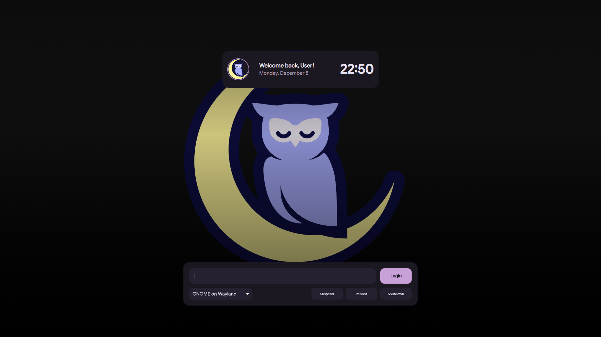

# Noctalia SDDM Theme

Noctalia SDDM is a cozy, elegant login theme for **SDDM (Simple Desktop Display Manager)**, designed to complement the **Noctalia Shell** experience. It mimics the warm, dark aesthetic of the Rose Pine color palette, featuring rounded corners, smooth scaling, and a clean, modern interface tailored for Hyprland and KDE users.



## Features

- **Rose Pine Aesthetic** – A soothing, high-contrast dark theme using the Rose Pine palette.
- **Responsive Scaling** – Automatically adapts to 1080p, 1440p, and 4K resolutions.
- **Smart Avatar Handling** – Automatically detects user profile pictures or gracefully falls back to defaults.
- **Session Management** – Built-in support for switching desktop sessions (Wayland/X11).
- **Integrated Power Controls** – Suspend, Reboot, and Shutdown accessible directly from the login screen.
- **Customizable Configuration** – easy tweaks via `theme.conf`.

## Installation

### 1. Clone the repository

```sh
git clone -b noctalia https://github.com/mahaveergurjar/sddm.git
```

### 2. Install the theme

Move the theme folder to the SDDM themes directory:

```sh
sudo cp -r sddm /usr/share/sddm/themes/
```

### 3. Configure SDDM

Edit your SDDM configuration file to use the new theme:

```sh
sudo nano /etc/sddm.conf
```

Add or modify the `[Theme]` section:

```ini
[Theme]
Current=sddm
```

### 4. Restart SDDM

To apply the changes, restart the display manager:

```sh
sudo systemctl restart sddm
```

## Configuration

You can customize colors, background, and blur settings in `theme.conf`:

```ini
[General]
background=Assets/background.png
blurRadius=0
# Rose Pine Color Palette overrides...
```

## Preview

You can test the theme without logging out by running the sddm-greeter in test mode:

```sh
sddm-greeter-qt6 --test-mode --theme /usr/share/sddm/themes/sddm
```

_Note: If you run into "module is not installed" errors, ensure you are using `sddm-greeter-qt6` and have `qt6-5compat` and `qt6-declarative` installed._

## Credits

- Designed for **Noctalia Shell**.
- Uses **Rose Pine** color palette.

---

**Contributions are welcome!** Feel free to fork and submit pull requests.
